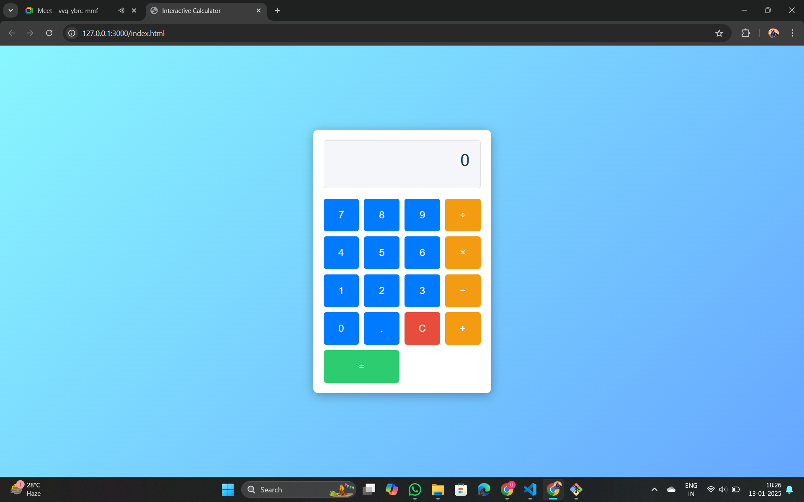

# Simple Calculator

An interactive, responsive calculator built with HTML, CSS, and JavaScript. This project provides a clean and visually appealing interface for performing basic arithmetic operations.

## Features
- **Basic Operations**: Perform addition, subtraction, multiplication, and division.
- **Responsive Design**: Works seamlessly on different screen sizes.
- **Real-time Display**: Updates the display with numbers and symbols as you type.
- **Clear Functionality**: Reset the calculator with the clear button.
- **Modern Interface**: Attractive gradient background and button animations for a smooth user experience.

## Technologies Used
- **HTML5**: Markup structure for the calculator.
- **CSS3**: Styling and layout, including animations and gradients.
- **JavaScript**: Logic for performing calculations and updating the display.

## How to Use
1. Clone this repository to your local machine:
   ```bash
   git clone https://github.com/rohanhake98/SimpleCalculator.git
   ```
2. Navigate to the project folder:
   ```bash
   cd SimpleCalculator
   ```
3. Open the `index.html` file in your browser.

## Screenshot


## Contributing
Contributions are welcome! If you have suggestions for improvements, please fork the repository and submit a pull request.


---

Feel free to reach out for any questions or feedback!
